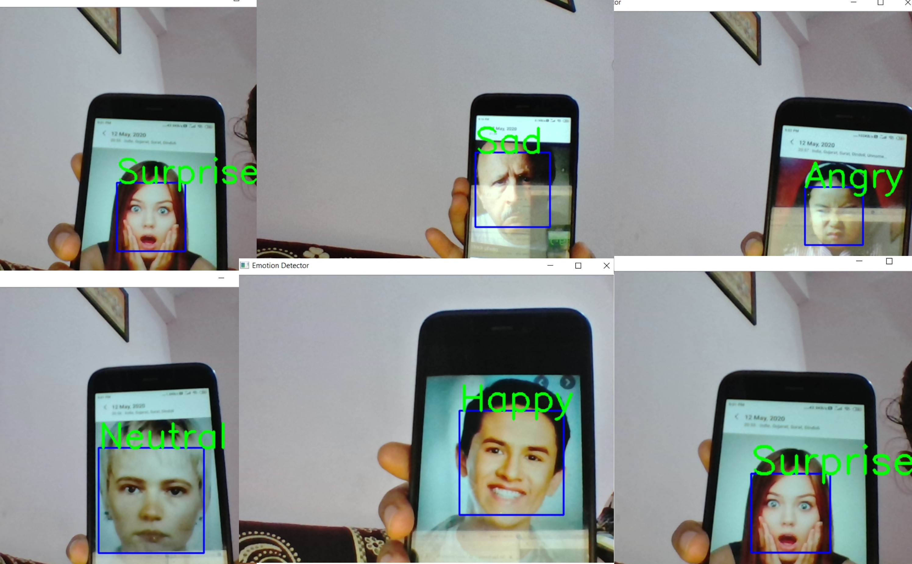

## Emotion-Detection

Facial emotion recognition is the process of detecting human emotions from facial expressions. The human brain recognizes emotions automatically, and software has now been developed that can recognize emotions as well. This technology is becoming more accurate all the time, and will eventually be able to read emotions as well as our brains do. 

AI can detect emotions by learning what each facial expression means and applying that knowledge to the new information presented to it. Emotional artificial intelligence, or emotion AI, is a technology that is capable of reading, imitating, interpreting, and responding to human facial expressions and emotions.

In this project i have used opencv for implementation of facial emotion detection in this when we run the python code webcam of your laptop will be opened and your face will be taken and according to your facial expression the emotion will be detected.

-  Keep Learning

## Dataset link-
```
https://drive.google.com/drive/folders/1E66iZdNz021aUZGsZjtc3EUu3NqAaIq3?usp=sharing
```

## Run
```
Copy the code and paste inside jupyter notebook/colab
cntrl+a and just shift+enter to view the output
```

## Output



## Just follow☝️ me and Star⭐ my repository 
